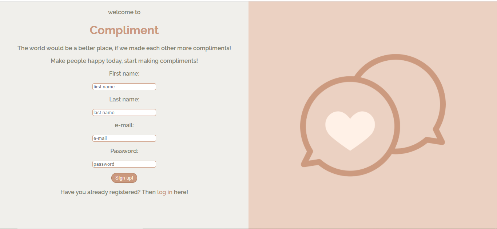
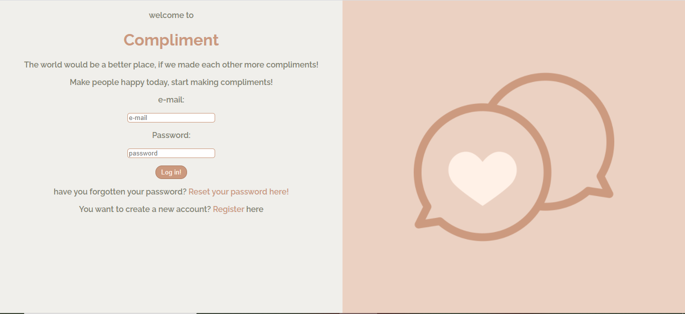
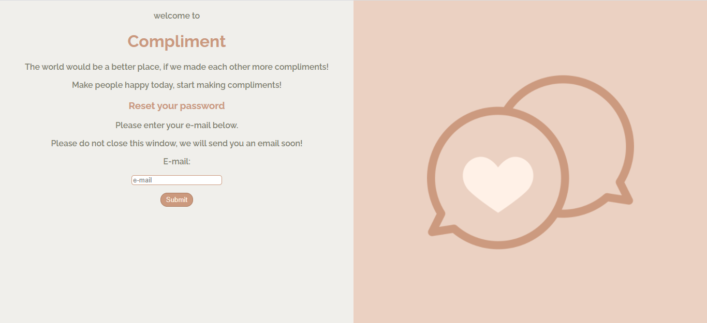
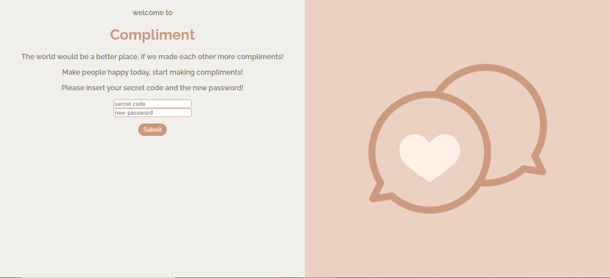
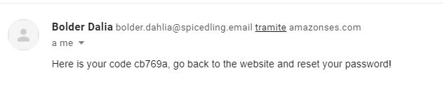

# COMPLIMENTS social network

## Description:

Social network allowing users to search, add and delete friends, post compliments on each other’s wall, compliment other online users on a chat and receive real-time notifications.

## Developed with:

-   React
-   Redux
-   React Hooks
-   Node.js
-   Express.js
-   axios
-   Socket.IO
-   AWS S3
-   AWS ses
-   PostgreSQL
-   Bcryptjs
-   Cookie-session
-   csurf
-   HTML/CSS

## Features:

Users are welcomed with a page that allows them to register or login, in case they have a profile already.
Users who forgot their password can reset it. An e-mail will be sent with AWS SES to the given address with a random code. The code will be valid only 10 minutes.

After registration or login, users come to their profile page:

-   users can change their profile picture. A modal opens, when the users click on the profile picture in the corner right or the big picture of the profile. This modal allows the users to upload a new profile picture. Pictures are stored in AWS S3.
-   users can add or change their bio.
-   users or friends can post on the user's wall.

From the navigation bar users can enter the **find friends** page. At first they will see the last three people who joined the network and can search by name or surname.

When users click on another user, they can visit the profile and send a friend request, accept a request or delete the friendship.

If the other user is a friend, the users will be able to see the bio and the wall. They will as well be able to post something on the wall.

Under **my friends** users can see their friends and friendship requests. If they receive a new friendship request, they will see a notification with the number of new requests in the navigation bar.

Under **chat** users can find a public chat to compliment each other. The chat as well as the request notifications update in real time.

